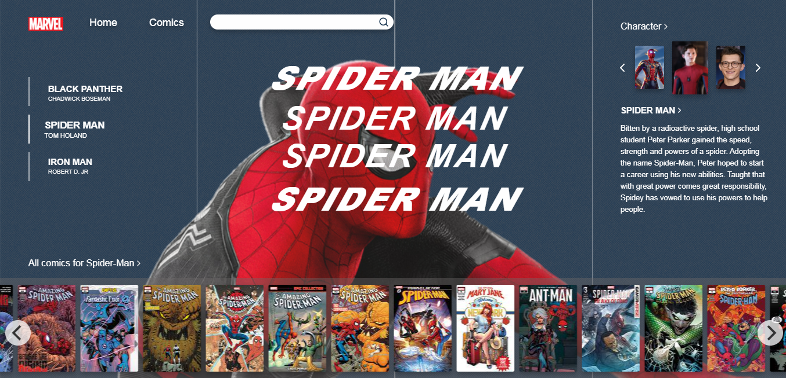

# Technical evaluation - Dextra

## :punch: Challenge

Development of a Marvel Comics comic catalog.

Marvel Comics provides an API where this data can be found, you must register on the Marvel platform to have access to [Marvel API](https://developer.marvel.com), free of charge.

Requirements:
- List of comics
- Title
- Image
- Thumbnail
- Authors
- Pagination of comics
- Grid of comics in 10 and 10
- Search by character using the character's name in English
- Detail of the comics
- Button or similar mechanism for opening a new page with details of the comic.
- Good coding practices
- Test coverage
- Responsive application

## :computer: Technologies Used

- React

## :star: Tests

- React Test Library

## :construction_worker: Installation
`yarn install`
Note: configure the env.json file by placing the system's apiKey (for evaluation purposes the file is available on the project's github).

### Screen Prototype

Prototyping the interface using the [figma](https://www.figma.com/) tool:

<h1 align = "center">
    
    
</h1>

### Web Screenshots

<h1 align = "center">

</h1>

### Screenshot Mobile Version

<h1 align = "center">

</h1>

## :man_teacher: Application development

To start the project, the [CRA](https://pt-br.reactjs.org/) of react was used and the additional ones to the template were:

- react-icons
- flickity
- react-router-dom
- react-test-renderer
- styled-components
- axios
- @ testing-library/react-hooks
- @ testing-library/user-event

## :information_source: Application info

The application is divided into three pages: Home, Comics and Detail.
The Home screen presents the idea of home page with the main Heroes listed on the home screen along with a list of Comics that it appears. The user can change heroes by clicking on the names attached to the left. To perform a search for a Comic or character the user can enter the data directly in the search field, or go to the Comic screen first by clicking on "Comics" in the header.

The Comic screen presents a simple filter to search for the comic or the character and entering his name, or an id, if the user has one. The search is performed automatically, requiring a minimum of 3 characters to be carried out. After the search, the gallery is shown below with the results obtained. At the end, there is a button to load 10 more data from the server and concatenate the user's view. Counters can be viewed in the lower right corner of the gallery, as well as survey feedback in the upper right. When clicking on an image the user will be redirected to the Detail screen.

The Detail screen shows the details of the Comic or Character according to the selection in the previous filter, at the end of the screen is also listed other characters that appear in the HQ, or other HQ's that the selected character appears.
